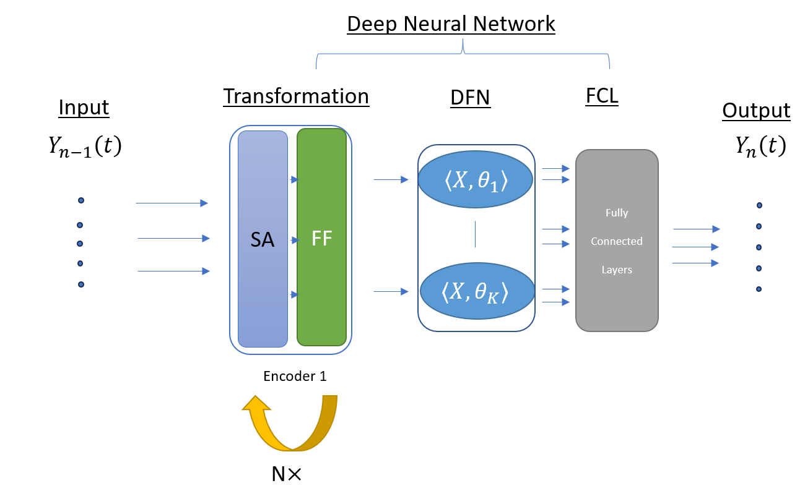

# Prediction-of-Employee-Presence-in-Smart-Workplaces
An Approach Integrating Functional Data and Exogenous Variables.

**1. About the robFTS prediction models**

We propose an approach that adapts the robust function-on-function regression to time series (RobFTS). 
The RobFTS model can be applied to predict the presence of workers in a tertiary building.

Let $\left(Y_n\right)_{n=1,\ldots,T}$ with for each $n$, $Y_n \in L^2(I)$, represent the functional time series of the number of workers per week.

We define $\left(X^k_n\right)_{n=1,\ldots,T}$, where $k=1,\ldots,K$, as the $K$-th exogenous functional time series, with $X^k_n \in L^2(I)$.

The model is defined as:

```math
Y_{n+1}(t) = \sum_{l=1}^L \int_I \beta_l(s,t) Y_{n+1-l}(s) \mathrm{d}s 
           + \sum_{k=1}^K \int_I \gamma_k(s,t) X_n^k(s) \mathrm{d}s + \varepsilon_n(t).
```

where $L$ is the number of lagged variables used, $\beta_l$ for $l=1,\ldots,L$, and $\gamma_k$ for $k=1,\ldots,K$ are the functional parameters to be estimated.

**2. About DFMM prediction model**

# Network Architecture

The four modules of our new network architecture are:

1. The transformation module is made of $N$ transformer encoders.
2. The Deep Functional Network that outputs the scores of multivariate functional variables.
3. Fully Connected Layers to reduce the dimension.
4. A regularisation module with a $L^2$ loss on the acceleration of parameters to produce the output.

The last module is not represented in the figure below as it is more a loss term added to the general loss than a proper network. You can read more about this architecture in [this paper](https://arxiv.org/abs/2106.10414).





